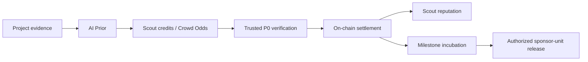

# Veil Scout

> Most hackathons stop at ranking. Veil Scout turns ranking into continuous builder discovery and milestone-based incubation.

**HTX Web3 Hackathon · AI x Web3**

[Public presentation demo](https://frontend-six-sigma-mw8xaa81il.vercel.app) · [Final submission](docs/submission/final-submission.md) · [Demo evidence](docs/submission/demo-evidence.md) · [Architecture](docs/pitch/demo-diagrams.md)

> **Demo status:** the public site is a labeled, read-only presentation build with seeded market data. For live local contract deployment and incubation reads, run the reproducible Anvil demo below.

```bash
bash veil-scout/scripts/run-live-demo.sh
```

## The Product in One Lifecycle

1. **Discover** — AI turns public project evidence into a structured AI Prior.
2. **Compare** — scouts allocate non-transferable credits and form Crowd Odds.
3. **Verify** — a trusted P0 oracle checks explicit GitHub or on-chain criteria.
4. **Settle** — contracts settle the market and update scout reputation.
5. **Incubate** — selected builders enter a separate milestone lane.
6. **Release** — an authorized reviewer releases a fixed sponsor-unit tranche after evidence review.

The discovery market generates signal. The incubation vault creates follow-through.

## Status at a Glance

| Status | Scope |
| --- | --- |
| **Implemented** | contracts, non-transferable credits, Crowd Odds, AI/verification reports, trusted settlement, reputation, incubation accounting, bilingual UI, CI, local E2E |
| **Demo-grade** | trusted oracle/reviewer roles, seeded market rows, sponsor-unit accounting, public fallback data |
| **Roadmap** | optimistic oracle/challenges, production custody, public testnet, HTX APIs, B.AI, `$HTX`, permissionless disputes |

Sponsor units do not custody or transfer tokens. AI and oracle reports are advisory. There is no AMM, LP exposure, automatic investment, governance, or real-money prediction market.

## Architecture



- **Track A — Solidity / Foundry:** seasons, credits, markets, settlement, leaderboard, incubation accounting
- **Track B — Python:** AI report, GitHub/on-chain verifier, advisory release assessment, evidence artifacts
- **Track C — Next.js:** bilingual judge console, wallet state, explicit live/fallback labels, end-to-end story

See the [detailed architecture and trust-boundary diagrams](docs/pitch/demo-diagrams.md).

## Why It Fits HTX

Veil Scout gives an ecosystem program operator a concrete funnel: discover credible builders during a hackathon, preserve evidence and scout signal, then monitor execution after the event. It can support hackathons, grants, incubators, launchpads, and ecosystem due diligence.

P0.8 claims no current HTX API, B.AI, or `$HTX` integration. See the [resource disclosure](docs/submission/ecosystem-resource-disclosure.md).

## Local Demo

Prerequisites:

- Node `24.16.0` (see `.nvmrc`)
- Python `3.11+`
- Foundry with `forge` and `anvil`
- frontend dependencies installed with `npm ci`
- Track B installed in a virtual environment

Run from the repository root:

```bash
bash veil-scout/scripts/run-live-demo.sh
```

Expected ready state:

- chain ID `31337`
- generated `IncubationVault` address
- vault ID `0`, status `ACTIVE`
- 3 milestones
- `4,000` sponsor units released and `8,000` remaining

## Verification

```bash
bash veil-scout/scripts/check-submission-package.sh

cd veil-scout/track-a-contracts
forge fmt --check
forge test

cd ../track-b-ai-oracle
python -m py_compile src/track_b/*.py scripts/incubation_e2e.py
pytest

cd ../frontend
npm run test:copy
npm run lint
npm run build

cd ../..
bash veil-scout/scripts/run-incubation-e2e.sh
```

CI runs the same submission, contract, Python, frontend, and E2E lanes.

## Repository Map

```text
docs/
  submission/                 canonical submission, evidence, disclosure, checklist
  pitch/                      narrative and architecture diagrams
  p0/specs/                   supporting mechanism and demo specifications
veil-scout/
  track-a-contracts/          Solidity contracts and Foundry tests
  track-b-ai-oracle/          AI/oracle CLI, reports, and pytest suite
  frontend/                   bilingual Next.js judge console
  scripts/                    verification, E2E, and one-command demo
```

## Judge Links

- [Final submission](docs/submission/final-submission.md)
- [Demo and verification evidence](docs/submission/demo-evidence.md)
- [HTX ecosystem resource disclosure](docs/submission/ecosystem-resource-disclosure.md)
- [Final submission checklist](docs/submission/final-submission-checklist.md)
- [Judge Q&A](docs/submission/p08-judge-qa.md)
- [Pitch narrative](docs/pitch/pitch-narrative.md)

Licensed under the [MIT License](LICENSE).
