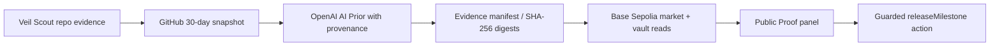
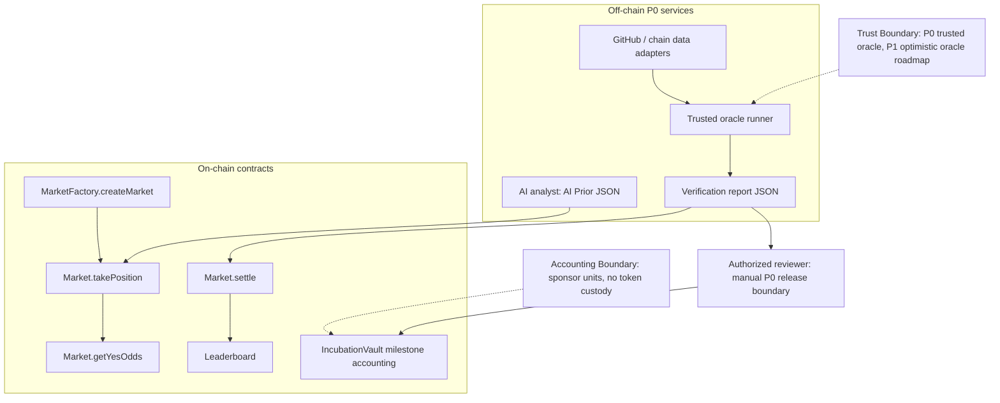

# Demo Diagrams

Use these diagrams as the source material for slides or the frontend demo explanation.

## Mechanism Loop

```mermaid
flowchart LR
    A["Project milestone proposal"] --> B["Reviewer approves binary MarketSpec"]
    B --> C["Track B generates AI Prior report"]
    C --> D["Scouts trade YES/NO with non-transferable credits"]
    D --> E["Crowd Odds updates from stake ratio"]
    E --> F["Deadline reached"]
    F --> G["Track B oracle verifies GitHub/on-chain data"]
    G --> H["Market.settle(marketId, passed)"]
    H --> I["Credits redistributed to correct scouts"]
    I --> J["Leaderboard reputation updates"]
    J --> K["Sponsor selects builder for incubation"]
    K --> L["Oracle assesses new milestone evidence"]
    L --> M["Authorized reviewer releases fixed sponsor units"]
```

## Public Proof Data Flow

The Public Proof panel must verify the manifest, artifact digests, chain ID `84532`, non-zero addresses, passing verification, active vault, unreleased milestone, connected chain, and `ORACLE_ROLE` before it enables release.

## Trust Boundary

## Judge-Facing Explanation

Veil Scout does not hide centralization in P0. The oracle runner is trusted for the demo, but every settlement is paired with a human-readable verification report. Incubation uses a separate authorized reviewer and demo sponsor-unit accounting; it does not custody tokens. The upgrade path is to move from trusted oracle to optimistic oracle, challenge period, report commitments, and an independently audited asset-flow design.
