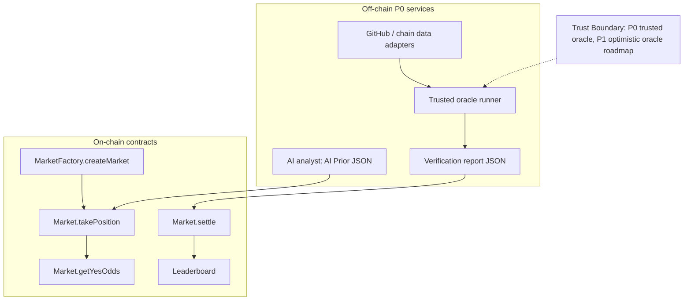

# Demo Diagrams

Use these diagrams as the source material for slides or the frontend demo explanation.

## Mechanism Loop

```mermaid
flowchart LR
    A["Project milestone proposal"] --> B["Reviewer approves binary MarketSpec"]
    B --> C["Track B generates AI Prior report"]
    C --> D["Scouts trade YES/NO with non-transferable credits"]
    D --> E["Crowd Odds updates from stake ratio"]
    E --> F["Deadline reached"]
    F --> G["Track B oracle verifies GitHub/on-chain data"]
    G --> H["Market.settle(marketId, passed)"]
    H --> I["Credits redistributed to correct scouts"]
    I --> J["Leaderboard reputation updates"]
```

## Trust Boundary

## Judge-Facing Explanation

Veil Scout does not hide centralization in P0. The oracle runner is trusted for the demo, but every settlement is paired with a human-readable verification report. The upgrade path is to move from trusted oracle to optimistic oracle, challenge period, and report commitments.
